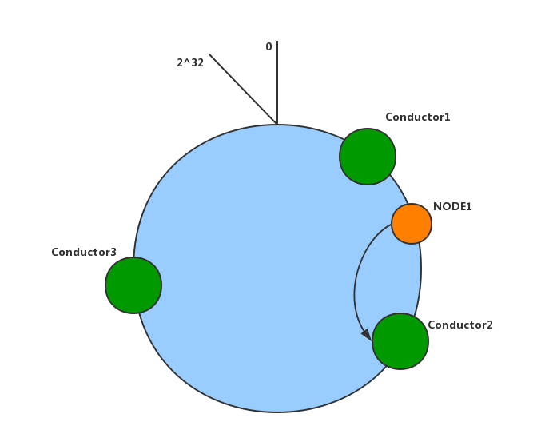

===========================
3.3 Ironic 一致性 Hash 算法
===========================

本文并不详细介绍一致性 Hash 算法，这里只介绍Ironic 如何使用一致性 Hash 算法。
有兴趣的朋友可以自行查阅资料 。

Hash 环构造过程
---------------

#. 首先 Ironic 获取所有 online 的 conductor 节点；

#. 根据 conductor 支持的驱动，把 conducor 划到不同的组里；

   存为字典结构： {driver_name1: [host1, host2], driver_name2: [host2, host3]}

   .. NOTE::
    当一个 conductor 配置支持多个驱动时，这个 conductor 会出现在不同组里。

#. 每个驱动创建一个 Hash 环，环的默认大小是 2^5。

   Hash 环的大小可以通过配置项 ``hash_partition_exponent`` 修改。

#. 将某个驱动所有的 conductor 节点加入到 Hash 环上；

   #. 将 conductor 的 hostname 进行 utf-8 编码，得到一个 key;
   #. 将 key 做 md5 运算，得到一个 key_hash;
   #. key_hash.update(key);
   #. 取 key_hask 的十六进制字符串并转换成整数 Ci;
   #. 把所有得到的整数 Ci 按大小排序，并报数到 partitions 数组中;

Node 映射到 Conductor
---------------------

#. 根据 node 驱动找到对应的 Hash 环;

   .. NOTE::
    每次操作时，Hash 都会重新生成，防止某个 conductor 离线而导致操作失败。

#. 根据 node_uuid hash 算出 hashed_key, 算法同上面;
#. 根据 hashed_key 在上面构造的 partitions 数组中找到合适的位置 p;
#. 根据 p 获取 Conductor 节点;

Example
-------

这里我们看一个例子，假设有三个 conductor 节点， 节点的 hostname 分别是:
conductor1, conductor2, conductor3. 这三个 conductor 都支持 ``pxe_ipmitool`` 驱动。

首先根据 hostname 构造一个 Hash 环，如下图所示。
然后根据 Ironic node 的 uuid hash 出一个 position, 离这个 position 最近的 conductor
就是要找的节点。

.. NOTE::
    如果希望异常是快速恢复，可以通过配置 ``hash_distribution_replicas`` 调度多个 conductor。

